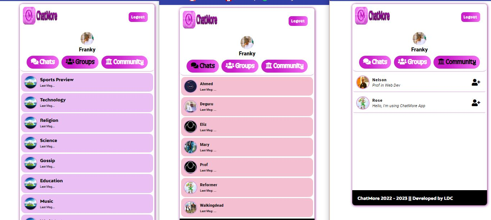

# ChatMore-App
A Web Chat Application, Designed with full functionalities (socket.io). 

## App Features:
-   (user => friends || user => groups || adding of other users)
-   Simple and Clean UI
-   Easy Navigation
-   Works Offline with MySQL Database
-   Sending, editing and deleting of any message 

## Task and How To Use The App
You can visit the App Online @(https://chatmoreapp.onrender.com)
-   Create a user if you have none || Login after creating a user
-   Add Friends from "community"
-   Start conversiation with friends or chat with friends in a group

**For Offline Purposes**
After cloning the repo to your local computer, install the necessary nodemon dependencies, Create a database (MySQL Database) with the name "chatmoreapp" import the file("chatmoreapp.sql") from the "MySQL-DB" folder inside "Public". change the "Conn.js" to that of your local computer username and password.

Start the App with "npm start" on the CLT

## License
[LDC](LICENSE.md)
